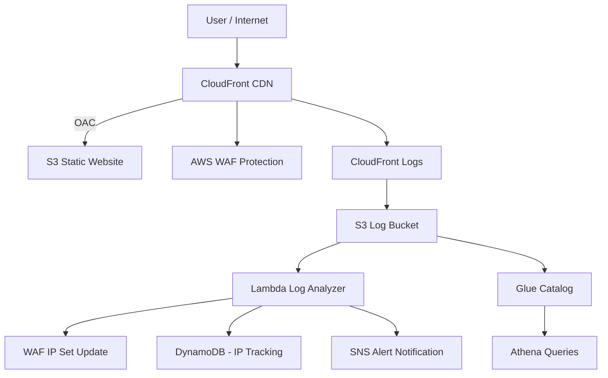

# 🔐 AWS Secure CDN with Automated WAF Protection

> Cloud-native security pipeline using CloudFront, WAF, Lambda, DynamoDB, SNS, Athena, and Terraform

---

## 🏷️ Badges


---

## 🧱 Architecture



---

## 🚀 Key Features

- Secure S3 origin using CloudFront Origin Access Control (OAC)
- AWS WAF protection with managed + custom rules
- Automated IP detection and blocking via Lambda
- Persistent attack tracking using DynamoDB
- Real-time security alerts via SNS notifications
- Log analytics using Glue + Athena
- Fully automated infrastructure using Terraform

---

## 🛡️ Security Note

AWS Shield Standard protection is implicitly enabled for CloudFront and provides automatic baseline DDoS protection without additional configuration.

This architecture builds on top of AWS Shield Standard by adding:
- Layer 7 threat detection (WAF rules)
- Custom IP reputation blocking
- Automated response (Lambda + SNS + DynamoDB)

---

## 🎯 Use Case

- Detect malicious traffic from CloudFront logs
- Analyze request patterns using Lambda
- Store suspicious IPs in DynamoDB
- Block abusive IPs via AWS WAF
- Send real-time alerts via SNS
- Enable forensic analysis using Athena

---

## 🚀 Deployment

```bash
terraform init
terraform apply
```

---

## 🧪 Testing

### XSS Test
```bash
curl -G --data-urlencode "q=<script>alert(1)</script>" https://<your-cloudfront-url>
```

### SQLi Test
```bash
curl -G --data-urlencode "id=1 OR 1=1" https://<your-cloudfront-url>
```

---

## 💰 Cleanup

```bash
terraform destroy
```
