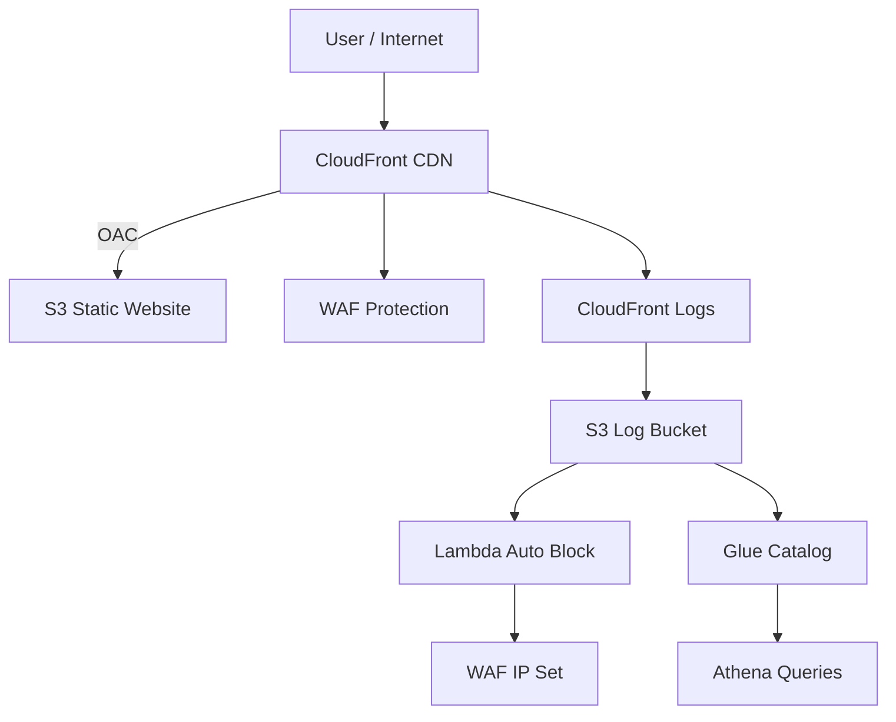

# 🔐 AWS Secure CDN with Automated WAF Protection

> Cloud-native security pipeline using CloudFront, WAF, Lambda, Athena, and Terraform

---

## 🏷️ Badges


---

## 🧱 Architecture



---

## 🚀 Key Features

- Secure S3 origin using CloudFront OAC
- AWS WAF with managed + custom rules
- Automated IP blocking via Lambda
- Log analytics using Glue + Athena
- Fully automated with Terraform

---

## 🎯 Use Case

Simulates a real-world DevSecOps pipeline:
- Detect malicious traffic
- Analyze logs
- Automatically block attackers

---

## 🧠 Skills Demonstrated

- Terraform (IaC)
- AWS Security (WAF, IAM, OAC)
- Event-driven architecture
- Log analytics (Athena, Glue)
- Automation (Lambda)

---

## 🚀 Deployment

```bash
terraform init
terraform apply
```

---

## 🧪 Testing

### XSS Test
```bash
curl -G --data-urlencode "q=<script>alert(1)</script>" https://<url>
```

### SQLi Test
```bash
curl -G --data-urlencode "id=1 OR 1=1" https://<url>
```

---

## 💰 Cleanup

```bash
terraform destroy
```
