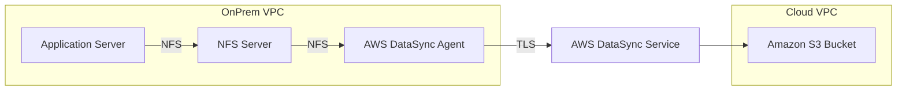

# 🔄 AWS Hybrid NFS Migration with DataSync & Terraform

> Terraform-based hybrid migration architecture using AWS DataSync, NFS, S3, VPC Peering, Systems Manager (SSM), and VPC Interface Endpoints.

---

# 🧱 Architecture



---

# 🚀 Project Overview

This project simulates a real-world hybrid migration architecture where an on-premises NFS server is migrated to Amazon S3 using AWS DataSync.

The environment is fully automated using Terraform and includes:

- Simulated on-premises environment using AWS VPCs
- NFS-based shared storage
- AWS DataSync hybrid migration service
- Secure Amazon S3 backend
- VPC peering
- Systems Manager (SSM)
- VPC Interface Endpoints
- IAM least privilege model

---

# 🏗️ Infrastructure Components

## 🔹 OnPrem VPC

Resources:

- Public subnet
- Private subnet
- NFS Server
- Application Server
- AWS DataSync Agent
- Route tables
- Internet Gateway
- Security Groups
- VPC Interface Endpoints

## 🔹 Cloud VPC

Resources:

- Public subnet
- Private subnet
- Amazon S3 bucket

---

# 🔄 Migration Workflow

```text
Application Server
        ↓ NFS
NFS Server
        ↓ NFS
DataSync Agent
        ↓ TLS
AWS DataSync Service
        ↓
Amazon S3 Bucket
```

---

# 🔐 Systems Manager (SSM) & VPC Endpoints

## ✅ Secure EC2 Access with SSM

This project uses AWS Systems Manager Session Manager to access EC2 instances securely without:

- SSH keys
- Bastion hosts
- Public SSH exposure

IAM Policy used:

```text
AmazonSSMManagedInstanceCore
```

Example:

```bash
aws ssm start-session   --target <INSTANCE_ID>   --region eu-west-3
```

---

## ✅ VPC Interface Endpoints

Private subnet instances communicate with AWS APIs using Interface VPC Endpoints instead of public internet or NAT Gateway.

Implemented endpoints:

```text
com.amazonaws.eu-west-3.ssm
com.amazonaws.eu-west-3.ssmmessages
com.amazonaws.eu-west-3.ec2messages
```

Benefits:

- No public internet dependency
- Reduced attack surface
- No bastion hosts
- Lower cost than NAT Gateway for this lab
- Private AWS API connectivity

---

# 🔐 Security Best Practices

## ✅ Encryption In Transit

AWS DataSync encrypts transfers using TLS.

## ✅ Encryption At Rest

S3 bucket encryption enabled using:

```text
SSE-S3 (AES256)
```

## ✅ IAM Least Privilege

Dedicated IAM roles used for:

- EC2 SSM access
- DataSync S3 access

## ✅ Private Networking

- Private subnets for servers
- Security Groups restrict access
- VPC Peering for private communication
- VPC Endpoints for AWS APIs

---

# 🧪 Validation & Testing

## Validate NFS Mount

```bash
ls -l /mnt/data
```

## Create Test File

```bash
echo "migration test" | sudo tee /mnt/data/test.txt
```

## Start DataSync Task

```bash
aws datasync start-task-execution   --task-arn <TASK_ARN>   --region eu-west-3
```

## Monitor Migration

```bash
aws datasync describe-task-execution   --task-execution-arn <EXECUTION_ARN>   --region eu-west-3
```

## Verify S3 Files

```bash
aws s3 ls s3://<BUCKET_NAME>/migration-output/ --recursive
```

---

# 🚀 Deployment

```bash
terraform init
terraform validate
terraform plan
terraform apply
```

---

# 💰 Cost Optimization

| Component | Instance Type |
|---|---|
| NFS Server | t3.micro |
| App Server | t3.micro |
| DataSync Agent | t3.medium |

> AWS DataSync requires at least 4 GiB RAM.

---

# 🧠 AWS SAA-C03 Concepts Covered

| Topic | Covered |
|---|---|
| VPC Design | ✅ |
| Public/Private Subnets | ✅ |
| VPC Peering | ✅ |
| Security Groups | ✅ |
| IAM Roles | ✅ |
| Systems Manager | ✅ |
| VPC Interface Endpoints | ✅ |
| DataSync | ✅ |
| Hybrid Migration | ✅ |
| S3 Encryption | ✅ |
| S3 Versioning | ✅ |
| Terraform IaC | ✅ |

---

# 🧹 Cleanup

## Empty Versioned S3 Bucket

```bash
aws s3api delete-objects   --bucket <BUCKET_NAME>   --delete "$(aws s3api list-object-versions     --bucket <BUCKET_NAME>     --query '{Objects: Versions[].{Key:Key,VersionId:VersionId}}')"
```

## Destroy Infrastructure

```bash
terraform destroy
```

---

# 📚 Learning Outcomes

By completing this project, you gain hands-on experience with:

- Hybrid AWS architectures
- NFS to S3 migration
- AWS DataSync
- Terraform Infrastructure as Code
- SSM private management
- VPC Interface Endpoints
- IAM least privilege
- Real-world troubleshooting

---

# 📌 Final Notes

This project intentionally focuses on:

```text
NFS → AWS DataSync → Amazon S3
```

to keep the architecture simple and aligned with AWS SAA-C03 hybrid migration objectives.
