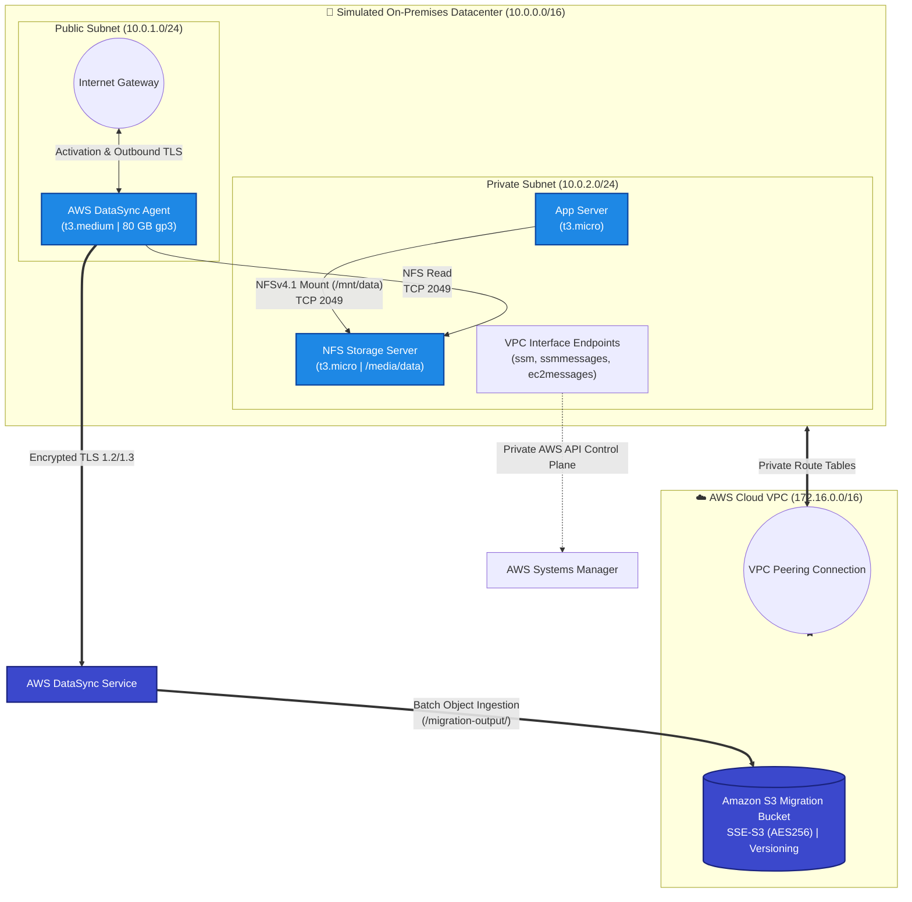

# 🔄 AWS Hybrid NFS Migration with AWS DataSync & Terraform

[](https://www.terraform.io/)
[](https://aws.amazon.com/)
[](https://aws.amazon.com/certification/certified-solutions-architect-associate/)
[](LICENSE)

An enterprise-grade, fully automated Terraform lab simulating a **hybrid on-premises to AWS cloud migration**. This project provisions an on-premises datacenter simulation with an active NFS cluster and migrates petabyte-capable datasets to **Amazon S3** using **AWS DataSync**, secured with **AWS Systems Manager (SSM)** and **VPC Interface Endpoints** (Zero Bastions, Zero SSH Keys).

---

## 📑 Table of Contents

- [Architectural Overview](#-architectural-overview)
- [Key Design Decisions](#-key-design-decisions)
- [Network & Infrastructure Topology](#-network--infrastructure-topology)
- [Repository Structure](#-repository-structure)
- [Prerequisites](#-prerequisites)
- [Step-by-Step Deployment](#-step-by-step-deployment)
- [Operational Runbook & Validation](#-operational-runbook--validation)
- [Troubleshooting & Common Pitfalls](#-troubleshooting--common-pitfalls)
- [Cost Optimization](#-cost-optimization)
- [AWS SAA-C03 Exam Concepts](#-aws-saa-c03-exam-concepts)
- [Teardown & Cleanup](#-teardown--cleanup)

---

## 🏛️ Architectural Overview


```mermaid
flowchart TB
    subgraph OnPrem_VPC["🏢 Simulated On-Premises Datacenter (10.0.0.0/16)"]
        direction TB
        
        subgraph Public_Subnet["Public Subnet (10.0.1.0/24)"]
            IGW(("Internet Gateway"))
            DSA["AWS DataSync Agent<br/>(t3.medium | 80 GB gp3)"]
            IGW <-->|"Activation & Outbound TLS"| DSA
        end

        subgraph Private_Subnet["Private Subnet (10.0.2.0/24)"]
            direction LR
            APP["App Server<br/>(t3.micro)"]
            NFS["NFS Storage Server<br/>(t3.micro | /media/data)"]
            VPCE["VPC Interface Endpoints<br/>(ssm, ssmmessages, ec2messages)"]
            
            APP -->|"NFSv4.1 Mount (/mnt/data)<br/>TCP 2049"| NFS
        end

        DSA -->|"NFS Read<br/>TCP 2049"| NFS
    end

    subgraph AWS_Cloud["☁️ AWS Cloud VPC (172.16.0.0/16)"]
        direction TB
        PEER(("VPC Peering Connection"))
        S3[("Amazon S3 Migration Bucket<br/>SSE-S3 (AES256) | Versioning")]
    end

    DSA ==>|"Encrypted TLS 1.2/1.3"| SYNC["AWS DataSync Service"]
    SYNC ==>|"Batch Object Ingestion<br/>(/migration-output/)"| S3
    OnPrem_VPC <===>|"Private Route Tables"| PEER <===> AWS_Cloud
    VPCE -.->|"Private AWS API Control Plane"| SSM_SVC["AWS Systems Manager"]

    classDef aws fill:#FF9900,stroke:#232F3E,stroke-width:2px,color:#fff;
    classDef storage fill:#3B48CC,stroke:#1A237E,stroke-width:2px,color:#fff;
    classDef compute fill:#1E88E5,stroke:#0D47A1,stroke-width:2px,color:#fff;
    class S3,SYNC storage;
    class DSA,APP,NFS compute;
```

---

## 💡 Key Design Decisions

| Feature | Architectural Rationale |
| :--- | :--- |
| **Zero-Bastion / Zero-SSH** | No inbound port 22 open anywhere. All EC2 management is executed over AWS Systems Manager (SSM) Session Manager via IAM credentials, fully logged and auditable. |
| **Private Control Plane** | Private subnet instances talk to AWS SSM APIs exclusively through **VPC Interface Endpoints** (PrivateLink), eliminating the need for NAT Gateways and saving ~$32/month per NAT GW in lab costs. |
| **DataSync In-Transit Security** | All data read from the local NFS export is streamed across an end-to-end TLS-encrypted tunnel directly into AWS DataSync managed service endpoints. |
| **Integrity Verification** | The DataSync task is configured with `verify_mode = "ONLY_FILES_TRANSFERRED"` and `transfer_mode = "CHANGED"` to ensure checksum validation upon write. |
| **Automated Storage Seeding** | The NFS server EC2 `user_data` automatically packages and exports sample dataset files at boot, making the lab instantly testable upon `terraform apply`. |

---

## 🌐 Network & Infrastructure Topology

### IP Addressing & Subnet Matrix

| VPC Name | CIDR Block | Subnet Type | Subnet CIDR | Associated Resources |
| :--- | :--- | :--- | :--- | :--- |
| `vpc-onprem-simulated` | `10.0.0.0/16` | **Public** | `10.0.1.0/24` | Internet Gateway, DataSync Agent (`t3.medium`) |
| `vpc-onprem-simulated` | `10.0.0.0/16` | **Private** | `10.0.2.0/24` | NFS Server (`t3.micro`), App Server (`t3.micro`), SSM Endpoints |
| `vpc-cloud` | `172.16.0.0/16` | **Public** | `172.16.1.0/24` | Internet Gateway, Cloud ingress |
| `vpc-cloud` | `172.16.0.0/16` | **Private** | `172.16.2.0/24` | Private cloud destination workloads |

### Security Group Ingress Rules

| Security Group | Source / CIDR | Port / Protocol | Purpose |
| :--- | :--- | :--- | :--- |
| `nfs-server-sg` | `10.0.0.0/16` (VPC CIDR) | TCP/UDP `2049` (NFS), `111` (RPC) | Allows App Server & DataSync Agent mount access |
| `vpc-endpoint-sg` | `10.0.0.0/16` (VPC CIDR) | TCP `443` (HTTPS) | Allows private instances to reach SSM Interface Endpoints |
| `datasync-agent-sg` | Public / AWS IP | TCP `80` (HTTP activation), Outbound `443` | One-time browser activation and DataSync control plane |

---

## 📁 Repository Structure

```text
aws-hybrid-datasync-migration/
├── ami.tf                 # SSM parameters for AL2023 & AWS DataSync AMIs
├── ec2.tf                 # Compute definitions: NFS Server, App Server, DataSync Agent
├── iam.tf                 # IAM roles & instance profiles (SSM & DataSync S3 access)
├── main.tf                # VPC peering, routes, S3 bucket, and DataSync Task
├── outputs.tf             # Useful deployment endpoints, IPs, and ARNs
├── providers.tf           # AWS provider and Terraform core constraints
├── security.tf            # Security groups (NFS, SSM endpoints, Agent)
├── variables.tf           # Input variables (AWS region configuration)
├── terraform.tfvars       # Environment-specific configuration values
├── vpc-enpoints.tf        # AWS PrivateLink Interface Endpoints for SSM
├── modules/
│   └── vpc/               # Reusable VPC module (Public + Private subnets & Route Tables)
└── docs/
    └── testing-notes.md   # Comprehensive CLI commands and operational test scripts
```

---

## ⚙️ Prerequisites

Before launching the project, verify that you have:

1. **Terraform**: `v1.5.0` or higher installed.
2. **AWS CLI**: `v2.x` configured with an IAM user or role with permissions for VPC, EC2, IAM, S3, and DataSync.
3. **AWS Session Manager Plugin**: Installed locally if connecting via CLI (`aws ssm start-session`).

---

## 🚀 Step-by-Step Deployment

### 1. Configure Variables
Inspect or update `terraform.tfvars` with your target AWS Region:
```hcl
aws_region = "eu-west-3"
```

### 2. Initialize and Validate
```bash
terraform init
terraform validate
```

### 3. Review Plan & Apply
```bash
terraform plan -out=tfplan
terraform apply tfplan
```

> **Note:** DataSync Agent provisioning takes approximately 3 to 4 minutes while the EC2 instance launches, initializes network interfaces, and registers with AWS DataSync.

---

## 🧪 Operational Runbook & Validation

Once `terraform apply` finishes, validate the complete end-to-end data pipeline:

### Step 1: Verify SSM Managed Instances
Ensure the instances are registered with AWS Systems Manager:
```bash
aws ssm describe-instance-information \
  --query "InstanceInformationList[*].[InstanceId,ComputerName,PingStatus,IPAddress]" \
  --output table \
  --region eu-west-3
```

### Step 2: Inspect the NFS Server Export
Connect to the NFS server via SSM without SSH keys:
```bash
# Get NFS Server Instance ID
NFS_ID=$(aws ec2 describe-instances \
  --filters "Name=tag:Name,Values=onprem-nfs-server" "Name=instance-state-name,Values=running" \
  --query "Reservations[0].Instances[0].InstanceId" \
  --output text --region eu-west-3)

# Start interactive SSM session
aws ssm start-session --target $NFS_ID --region eu-west-3
```

Inside the session, confirm the service and initial test files:
```bash
sudo exportfs -v
ls -la /media/data/images
exit
```

### Step 3: Write New Data from the Application Server
Connect to the App Server and simulate production file generation:
```bash
APP_ID=$(aws ec2 describe-instances \
  --filters "Name=tag:Name,Values=onprem-app-server" "Name=instance-state-name,Values=running" \
  --query "Reservations[0].Instances[0].InstanceId" \
  --output text --region eu-west-3)

aws ssm start-session --target $APP_ID --region eu-west-3
```

Inside the App Server, generate new payload files on the mounted NFS share:
```bash
# Verify the mount
df -h /mnt/data

# Create live test files
sudo mkdir -p /mnt/data/live-migration-batch
for i in {1..10}; do
  echo "Live transaction file $i generated on $(date)" | sudo tee /mnt/data/live-migration-batch/tx-$i.log
done
exit
```

### Step 4: Execute the DataSync Migration Task
Trigger the automated migration task from your workstation:
```bash
TASK_ARN=$(terraform output -raw datasync_task_arn)

EXECUTION_ARN=$(aws datasync start-task-execution \
  --task-arn $TASK_ARN \
  --region eu-west-3 \
  --query "TaskExecutionArn" --output text)

echo "Started Execution: $EXECUTION_ARN"
```

### Step 5: Monitor Execution Progress
Track the progress in real time through the lifecycle stages (`LAUNCHING` → `PREPARING` → `TRANSFERRING` → `VERIFYING` → `SUCCESS`):
```bash
aws datasync describe-task-execution \
  --task-execution-arn $EXECUTION_ARN \
  --region eu-west-3 \
  --query "{Status:Status,FilesTransferred:FilesTransferred,BytesTransferred:BytesTransferred,Result:Result}" \
  --output json
```

### Step 6: Verify Migrated Data in S3
Check the destination S3 bucket to confirm all files were migrated with their exact directory structure:
```bash
BUCKET_NAME=$(terraform output -raw migration_bucket_name)

aws s3 ls s3://$BUCKET_NAME/migration-output/ --recursive --human-readable
```

---

## 🛠️ Troubleshooting & Common Pitfalls

| Issue | Root Cause | Resolution |
| :--- | :--- | :--- |
| **Agent Activation Timeout** | The DataSync agent needs HTTP port 80 open during registration. | Verify `datasync_agent_sg` allows inbound port 80 to the agent IP from the machine running Terraform during apply. |
| **SSM Session Fails (`TargetNotConnected`)** | SSM agent hasn't finished starting or interface endpoints aren't reachable. | Wait 60–90 seconds after boot. Verify `vpc-endpoint-sg` allows port 443 from the private subnet CIDR. |
| **NFS Mount Hanging on App Server** | Security group blocking port 2049 or RPC port 111. | Check that `nfs_server_sg` includes ingress rules for `10.0.0.0/16` on ports `2049` (TCP/UDP) and `111`. |
| **Bucket Destroy Error (`BucketNotEmpty`)** | S3 bucket has versioning enabled, leaving delete markers / noncurrent versions. | Run the S3 version purge script (below) before executing `terraform destroy`. |

---

## 💰 Cost Optimization Guide

This lab is tuned to minimize AWS charges while meeting AWS DataSync minimum system constraints:

| Resource | Sizing | Purpose | Approx. Cost (Hourly) |
| :--- | :--- | :--- | :--- |
| `onprem-nfs-server` | `t3.micro` | Lightweight NFS daemon | ~$0.0104 / hr |
| `onprem-app-server` | `t3.micro` | Simulated client | ~$0.0104 / hr |
| `datasync-agent` | `t3.medium` (4 GiB RAM) | DataSync minimum requirement | ~$0.0416 / hr |
| `vpc_endpoints` (3x) | PrivateLink | Private SSM connectivity | ~$0.0300 / hr |
| `migration_bucket` | Standard S3 | Destination storage | ~$0.023 / GB / mo |

> **Pro-Tip:** Always tear down the environment immediately after testing to avoid ongoing EC2 and VPC Endpoint hourly costs.

---

## 🎓 AWS SAA-C03 Exam Concepts Highlighted

- **AWS DataSync vs. Storage Gateway:** DataSync is purpose-built for one-time or scheduled bulk batch data migrations to S3/EFS/FSx; Storage Gateway provides continuous hybrid cloud caching and file gateway access.
- **DataSync Agent Placement:** For on-premises to cloud migrations, the agent must sit closest to the storage source (on-premises or inside the source VPC) with NFS/SMB read connectivity.
- **PrivateLink vs. NAT Gateway:** Interface endpoints provide private, high-security connectivity to AWS API services from private subnets without traversing the public internet or provisioning NAT Gateways.
- **S3 Bucket Security:** Enforcing default AES-256 server-side encryption (`SSE-S3`) and object versioning to protect against accidental deletion during migration experiments.

---

## 🧹 Teardown & Cleanup

Because S3 bucket versioning is enabled, delete all object versions and delete markers before destroying infrastructure:

```bash
BUCKET_NAME=$(terraform output -raw migration_bucket_name)

# 1. Purge all versions and delete markers
aws s3api delete-objects \
  --bucket $BUCKET_NAME \
  --delete "$(aws s3api list-object-versions \
    --bucket $BUCKET_NAME \
    --query '{Objects: Versions[].{Key:Key,VersionId:VersionId}}')"

# 2. Destroy all Terraform resources
terraform destroy -auto-approve
```

---

## 📜 License

This project is licensed under the MIT License - see the [LICENSE](LICENSE) file for details.
