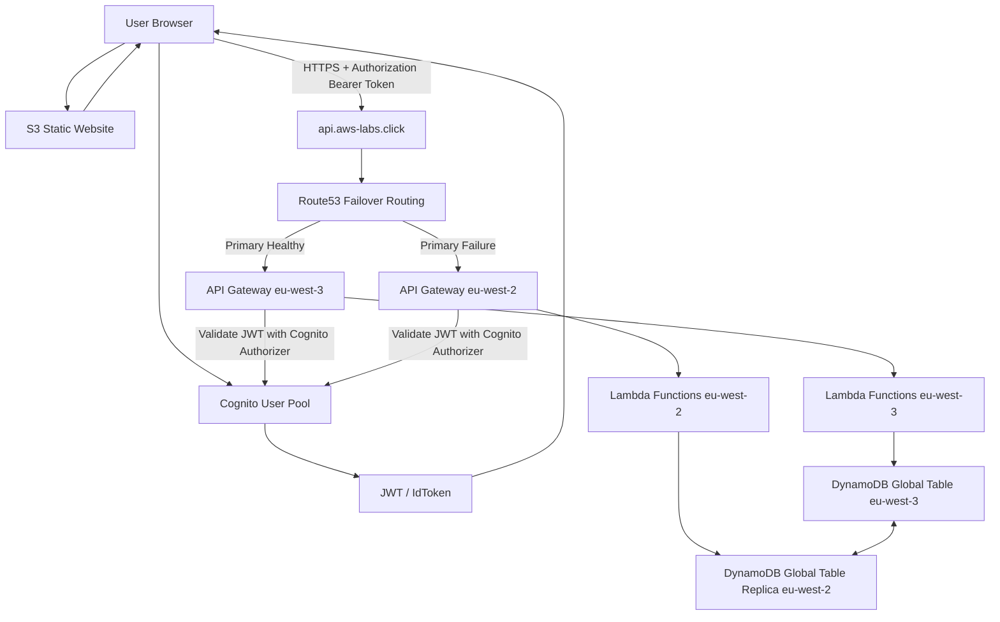

# 🌍 AWS Serverless HA/DR Platform with Cognito Authentication

> Multi-region serverless High Availability & Disaster Recovery architecture using API Gateway, Lambda, DynamoDB Global Tables, Route 53 Failover, Cognito, and Terraform

---

## 🏷️ Badges


---

# 🧱 Architecture



---

# 🚀 Key Features

- Multi-region serverless architecture
- DynamoDB Global Tables replication
- Automatic Route53 failover
- Regional API Gateway deployment
- AWS Lambda compute in both regions
- Cognito JWT authentication
- S3-hosted frontend application
- API Gateway throttling protection
- Least privilege IAM permissions
- Fully automated infrastructure using Terraform

---

# 🌍 Regions

| Role | Region |
|---|---|
| Primary Region | `eu-west-3` |
| Secondary Region | `eu-west-2` |

---

# 🔐 Security Features

- Cognito User Pool authentication
- JWT token authorization
- API Gateway Cognito authorizer
- Least privilege IAM policies
- HTTPS everywhere
- ACM-managed TLS certificates
- API throttling protection

---

# 🎯 Use Case

This project demonstrates how to build a resilient serverless platform capable of:

- surviving regional outages
- maintaining API availability
- replicating data across regions
- protecting APIs using Cognito authentication
- automatically routing traffic during disasters
- continuing write operations during failover

---

# 🚀 Deployment

```bash
terraform init
terraform apply
```

---

# 🧪 Testing

## DynamoDB Replication Test

### Write Through Primary Region

```bash
curl -X POST "$(terraform output -raw primary_write_endpoint)" \
  -H "Content-Type: application/json" \
  -d '{"ItemId":"item-001","Data":"Hello from eu-west-3 primary"}'
```

### Read From Secondary Region

```bash
curl "$(terraform output -raw secondary_read_endpoint)"
```

---

# 🔐 Cognito Authentication Test

## Authenticate User

```bash
aws cognito-idp initiate-auth \
  --auth-flow USER_PASSWORD_AUTH \
  --client-id <CLIENT_ID> \
  --auth-parameters USERNAME=<USERNAME>,PASSWORD='<PASSWORD>' \
  --region eu-west-3
```

## Authenticated API Request

```bash
curl https://api.aws-labs.click/read \
  -H "Authorization: Bearer <ID_TOKEN>"
```

---

# 🌍 Route53 Failover Test

## Simulate Primary Failure

```bash
aws lambda remove-permission \
  --function-name serverless-ha-dr-dev-read-primary \
  --statement-id AllowExecutionFromAPIGatewayRead \
  --region eu-west-3
```

## Validate Failover

```bash
curl https://api.aws-labs.click/read \
  -H "Authorization: Bearer <ID_TOKEN>"
```

Traffic should automatically switch to:

```text
eu-west-2
```

---

# 🔄 Disaster Recovery Validation

## Write During Failover

```bash
curl -X POST https://api.aws-labs.click/write \
  -H "Authorization: Bearer <ID_TOKEN>" \
  -H "Content-Type: application/json" \
  -d '{"ItemId":"dr-test-001","Data":"Written during DR failover"}'
```

## Validate Replication Back To Primary

```bash
curl "$(terraform output -raw primary_read_endpoint)" \
  -H "Authorization: Bearer <ID_TOKEN>"
```

---

# 🛡️ HA/DR Flow

```text
Normal Operation:
User -> Route53 -> Primary Region

Failure Detected:
Route53 Health Check Fails

Automatic Recovery:
Route53 -> Secondary Region

Data Persistence:
DynamoDB Global Tables replicate changes across regions
```

---

# 💰 Cleanup

```bash
terraform destroy
```

---

# 📚 Technologies Used

- Terraform
- AWS Lambda
- API Gateway
- DynamoDB Global Tables
- Route53
- Cognito
- ACM
- S3 Static Website Hosting
- IAM
- CloudWatch Logs
